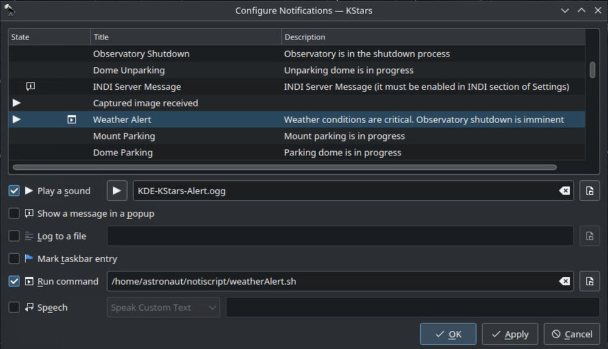

# Pushover notifications for KStars

## Push notifications with [Pushover](https://pushover.net) for [KStars](https://edu.kde.org/kstars/)

Place all in ~/notiscript folder; set your APP_TOKEN and USER_TOKEN in pushover_CONFIGURE file, then rename to pushover

make it executable with:

`chmod +x ~/notiscript/pushover`

`chmod +x ~/notiscript/*.sh`

Now set your desired notifications.

get your notifications:

ToDo: integration with [KStars messages translated](https://github.com/KDE/kstars/blob/8351de0c6200e1678137c9030d6b3b1a0d285d76/kstars/kstars.notifyrc).